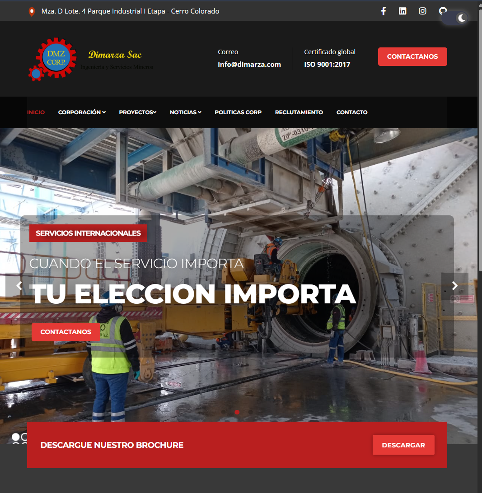

# Página Web de Dimarza Sac


Bienvenido al repositorio de la página web de **Dimarza Sac**, una empresa dedicada a brindar soluciones innovadoras en la industria minera. Este proyecto presenta una interfaz moderna y responsiva, adaptándose tanto al modo claro como al modo oscuro.

## Descripción

La página web de **Dimarza Sac** está diseñada para mostrar los proyectos recientes, información sobre la empresa y facilitar el contacto con los interesados. El sitio incluye características como un menú de navegación, carrousel de proyectos, y formularios para contacto y reclutamiento.

## Tecnologías utilizadas

- **HTML5**: Estructura de la página web.
- **CSS3**: Estilos de la interfaz, incluyendo un diseño responsivo y un modo oscuro.
- **JavaScript**: Funcionalidad interactiva para el menú, el cambio de temas (modo claro/oscuro), y la navegación.
- **Bootstrap**: Framework de diseño para crear interfaces responsivas y modernas.
- **FontAwesome**: Para los iconos y fuentes estilizadas.
- **Swiper.js**: Para el carrusel de proyectos.
- **jQuery**: Biblioteca de JavaScript para facilitar manipulaciones DOM y AJAX.

## Características

- **Modo Claro y Modo Oscuro**: La página cambia entre un esquema de colores claro y oscuro según las preferencias del usuario.
- **Responsividad**: El diseño se adapta automáticamente a diferentes tamaños de pantalla, desde móviles hasta escritorios.
- **Navegación fácil**: Con un menú desplegable y enlaces a las secciones clave del sitio como "Proyectos", "Noticias", y "Contacto".
- **Carrusel interactivo**: Muestra proyectos recientes de la empresa con imágenes interactivas.

## Instalación

1. **Clona el repositorio**:
   ```bash
   git clone https://github.com/alexander_dheins/dimarza-web.git


## 🔗 Links
[](https://lexpy.dev/)


## 🛠 Skills
Javascript, HTML, CSS

Framework: Boostrap 


## Insignias

Implementacion de insignias y certificados : [shields.io](https://shields.io/)

[](https://choosealicense.com/licenses/mit/)
[](https://opensource.org/licenses/)
[](http://www.gnu.org/licenses/agpl-3.0)


## Autores

- [@Alexander-Dheins](https://github.com/Alexander-Dheins)


## Suporte

El soporte se puede obtener por correo electrónico a soporte@lexpy.com.


## Usado por

Este presente proyecto se desarrolla para estas empresas.

- DIMARZA SAC
- DIMARZACHILE SPA.

